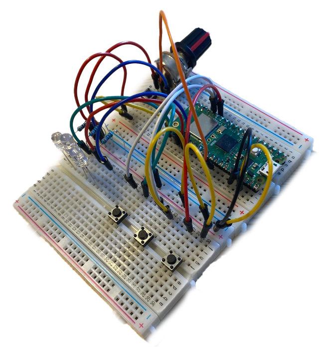
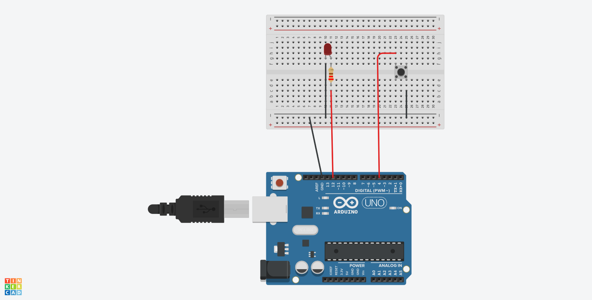

# Reaction Time Tester

## Overview

This project initially utilizes a Raspberry Pi Pico W, multiple LEDs, a button, and a potentiometer to create a reaction time tester. The user's reaction time is recorded and stored in a MySQL database for analysis. The difficulty level of the tester can be adjusted using the potentiometer.

However, the project was rewritten in C++ and simplified to be used with the Arduino Uno to help teach others the basics of Arduino programming. 

This project allowed me to develop both my technical and soft skills. Notable technical skills developed were developing a PHP website to display users' reaction times. Implementing a potentiometer taught me the basics of analogue inputs and using the built-in adc pins on the Raspberry Pi Pico.

Equally important were the soft skills developed using this project as a teaching tool for others interested in Arduino. This includes communication, demonstration, and teaching. 

## Raspberry Pi Pico W Version

  

### Features
- Supports three different modes of varying difficulty.
- Generate a random time before the LED changes to prevent participants from predicting when the LED will change.
- Detects when the user is holding down the button before the LED changes.
- Uses the urequests library to send reaction time to mySQL database via PHP script.
- Reaction time data is then retrieved from the mySQL database and displayed on a webpage.

## Arduino Version

  

### Features
- Teaches students the basics of C++ programming and Arduino
- Introduces students to linking hardware with software.
- Students can quickly implement additional levels due to the formatting of the code. Enabling students to think for themselves and experiment.
- Demonstrates to students how to interface with basic input and output devices (Buttons and LEDs)
- Introduces students to the serial connection used extensively throughout microcontroller programming for debugging. 

